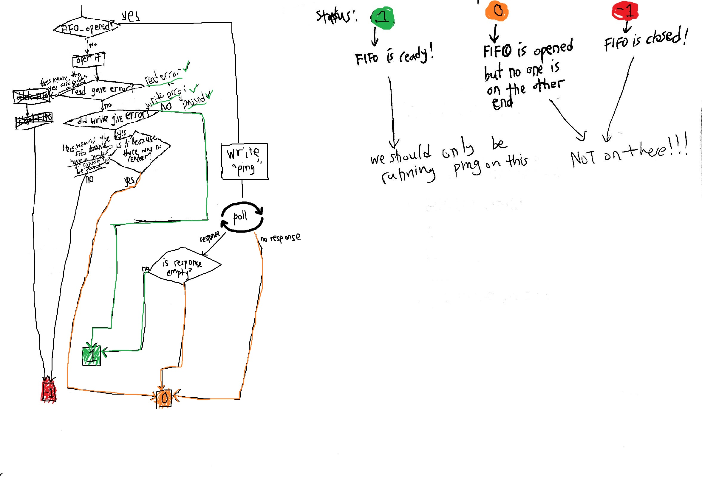

# Scraper Communicator

So the image below gives a kind of idea as to the intent of this little snippet of code.

What's going on is the the server hosts the webapp, and we want a
service where the scraping isn't stuck to one location. Whether I'm on
a laptop or a PC or a moving car, as long as I have access to a port
on a server, the application should be able to access the communicator.

The goal is that the communicator should "communicate" with the webapp
about some "queries" and the communicators should communicate with the scraper (should they be found) about the interaction across them. 

Essentially the communicator is a pass through so that the Web app 
doesn't need to do any socket programming. Instead, the scraper and the
communicator are solely responsible for connections.

# CHECKOUT
