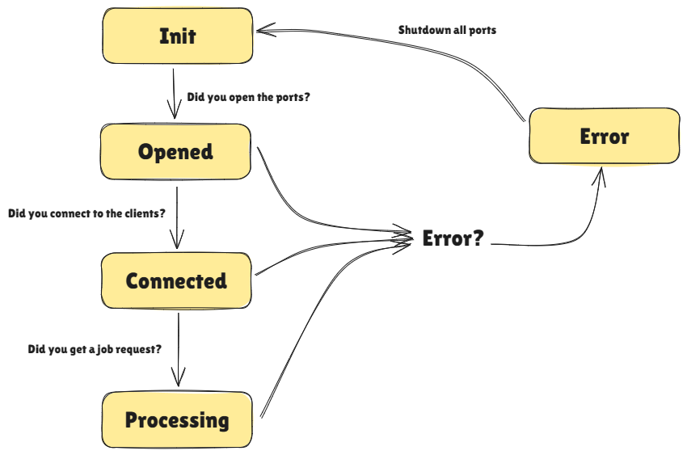

# Diplomat

The IPC delegator.

## Characteristics

- Used for IPC processes (sockets, fifos)
- Tries to establish a trusted connection ("PING, PONG")
- Assumes the worst and tries to break off connection once an error
is reached.
- Is *live*. (It uses a while loop). In particular, diplomats is 
a FSA and provides information on what the foreign party is doing

